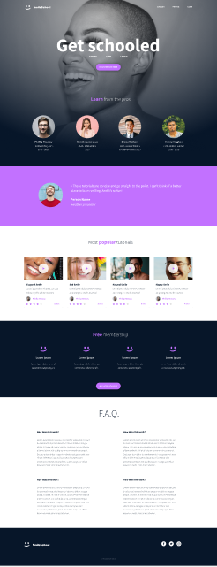

# HTML, advanced

## Project Overview : 🔍

Welcome to the Webpage Implementation Project! In this series of projects, you will have the opportunity to build webpages from designer files, starting with the HTML structure. The primary goal of this first project is to focus exclusively on HTML, emphasizing semantic markup and proper document structure.

### Goal :🎯
Implement the HTML structure of a webpage based on a designer file provided on Figma. The emphasis is on semantic HTML, ensuring a clear and meaningful structure for the content.

### Project Details : 📌

- **Task**: Implement the HTML structure based on the designer file provided on Figma.
- **File Format**: Figma
- **Designer File Link**: [Page in Figma](https://www.figma.com/file/XrEAsu1vQj5fhVaNG38d2W/Homepage?type=design&node-id=0-1&mode=design)
- **Figma Design**:  

### Accessing Design Details : 🧷

To access all the design details, please follow these steps:

1. Create a Figma account if you don't have one.
2. Visit the [Page in Figma](https://www.figma.com/file/XrEAsu1vQj5fhVaNG38d2W/Homepage?type=design&node-id=0-1&mode=design).
3. Duplicate the file to your drafts to gain access to all design details.

### Contributing : 📈 

Contributions are always welcome!

If you have any improvements, suggestions, or find issues, feel free to open an issue or create a pull request .

Happy Coding ! 

### AUTHOR 
Made with Love by Cyrine ❤️  
[Cyrine Zekri](https://github.com/CyrineZekri)

